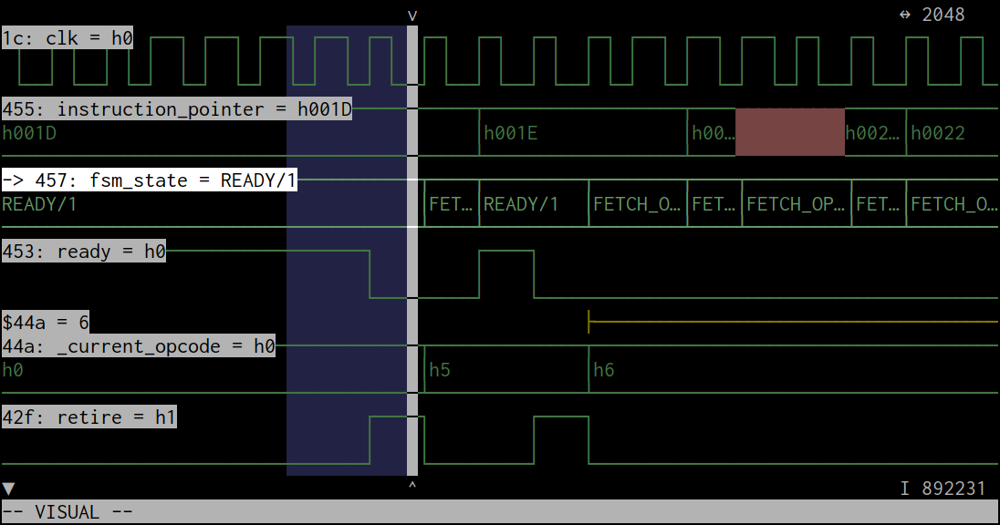

DWFV
====

[](https://travis-ci.com/psurply/dwfv)
[](https://crates.io/crates/dwfv)
[](https://docs.rs/crate/dwfv/)

A simple digital waveform viewer with vi-like key bindings.

```shell
$ dwfv sample.vcd
```



The tool takes a Value Change Dump (VCD) file (as defined by IEEE Standard
1364-1995) as input and displays the waveforms using
[tui-rs](https://github.com/fdehau/tui-rs).

The backend API which facilitates the manipulation of digital signals in Rust
is also exposed and can be used independently of the TUI.

Installation
------------

```shell
$ cargo dwfv
```

From sources:

```shell
$ cargo install --path .
```

Key Bindings
------------

### Global

- `q`: quit

### Cursor movement

- `h`: move cursor left
- `j`: move cursor down
- `k`: move cursor up
- `l`: move cursor right
- `w`: jump forward to the next rising edge
- `e`: jump forward to the next falling edge
- `b`: jump backward to the previous rising edge
- `0`: jump to timestamp 0
- `^`: jump to the first event
- `$`: jump to the last event
- `gg`: jump to first signal
- `G`: jump to last signal

### Frame

- `zi`/`+`: zoom in
- `zo`/`-`: zoom out
- `zc`/`=`: zoom fit
- `zz`: center cursor on screen

### Editing

- `o`: edit layout
- `dd`: delete the selected signal
- `yy`: copy the selected signal
- `p`: paste the clipboard after cursor
- `P`: paste the clipboard before cursor

### Search

- `/pattern`: search for pattern in the selected signal
- `n`: repeat search forward
- `N`: repeat search backward

### Visual mode

- `v`: start visual mode
- `<enter>`: zoom fit the selected time frame

### Mouse

- Left click: move cursor
- Right click: zoom out
- Wheel up: zoom in
- Wheel down: zoom out
- Hold/release left click: zoom fit the selected time frame

Command-Line Interface
----------------------

### Show some stats about the VCD file

```shell
$ dwfv examples/sample.vcd stats
test
  ! (value) - width: 8, edges: 37, from: 0, to: 1010
  " (clk) - width: 1, edges: 102, from: 0, to: 1010
  # (reset) - width: 1, edges: 5, from: 0, to: 620
  c1
    " (clk) - width: 1, edges: 102, from: 0, to: 1010
    # (reset) - width: 1, edges: 5, from: 0, to: 620
    $ (out) - width: 8, edges: 37, from: 0, to: 1010
```

### Display values of the signal at a given time

```shell
$ dwfv sample.vcd at 42
test
  ! (value) = h07
  " (clk) -> h0
  # (reset) = h0
  c1
    " (clk) -> h0
    # (reset) = h0
    $ (out) = h07
```

### Search in the waveforms

```shell
$ dwfv sample.vcd when '$! = 2'
310-330
650-670
$ dwfv sample.vcd when '$! <- 4'
350
690
```

LICENSE
-------

[MIT](LICENSE)
